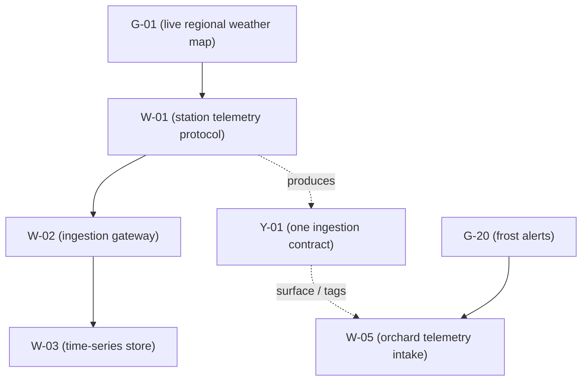

+++
title = "Causality and knowledge"
description = "In an agent-driven project, causality follows the dependency graph and knowledge follows file paths and glossary tags. Both arrive in one packet."
datePublished = 2026-09-15T23:00:00+03:00
dateModified = 2026-09-15T23:32:36+03:00
tags = ["ai", "graphtheory", "programming"]
+++

Here is the execution packet an agent received before starting a task. The task belongs to a brand-new goal in a brand-new area of the project: nothing blocks it, and it blocks nothing.

```text
## Contraction order

## Forward cone (impact)

## Fragility

- G-20: no blocks-path

## Relevant discoveries

- Y-01: Field telemetry enters through one ingestion contract
```

The causal sections are empty. The last section is not. Somewhere in this project's past, an earlier goal finished, and the knowledge it produced just showed up in a task it has never met. No dependency edge connects them. Nothing in the causal graph explains why this task should know about that contract.

This article is about how it got there.

In [the previous article](https://alxshelepenok.com/blog/your-project-has-a-light-cone) I described the causality cone: the backward cone of what must exist first, the forward cone of what will feel the change, the fragility count that tells you how redundant the goal's connection to this task is. That is causality. It runs along `blocks` edges, and it answers questions of structure.

Knowledge is the second: what the project has already learned, distilled from finished work into nodes that carry file paths and glossary tags, and routed to new work by matching those anchors. It answers a different question. Not *what must exist*, but *what is already known*.

## What evaporates

An agent finishes a goal. For weeks it has held the whole picture: why the telemetry protocol chose framed binary over JSON, why the wind-chill model reads calibration tables instead of computing, which retry pattern the queue tolerates. Then the session ends, the conversation scrolls away or gets compacted, and six weeks later a new goal in a different area touches the same files. The next agent starts from zero. Sometimes it reinvents what was learned. Sometimes it breaks what was learned, confidently.

Every shop fights this with documents, and every document rots at its own speed, because nothing forces it to be written, nothing anchors it to the code it describes, and nothing routes it to the person or agent who needs it.

Grove's bet is that knowledge can be a node. If it has provenance and anchors, it can be gated, routed, and decayed mechanically. But first it has to be forced to exist.

## Distillation is a gate, not a suggestion

Here is the lifecycle, from a real session. A work item lands `done` with evidence attached, the goal's status re-derives to `verified`, and the CLI itself speaks up:

```console
$ grove set W-01 status=done
grove: goal G-01 (Live regional weather map) verified,
distill content: `grove distill G-01`
(or `grove distill G-01 --null` when nothing is worth keeping).
```

The distillation worksheet is equally direct:

```text
distillation worksheet for G-01 (Live regional weather map)
archive precondition: not met; `grove archive G-01` refuses until a Discovery is linked
or a null-distill attestation exists
no validated B / answered Q / accepted D in the goal's mass
nothing worth distilling? `grove distill G-01 --null`
```

A goal cannot be archived while it still owes knowledge. The archive command refuses until a Discovery is linked, or until you attest on the record that nothing was worth keeping. Both exits leave a trace: extraction, or a signed statement that you looked and found nothing.

## Anatomy of a discovery

The knowledge node from the session above, in full:

```console
$ grove add y --title="Field telemetry enters through one ingestion contract" \
    --surface=telemetry.rs,gateway.rs \
    --tags=telemetry,ingestion --from=W-01
$ grove link W-01 produces Y-01
$ grove set Y-01 status=active
```

```text
y Y-01 status=active "Field telemetry enters through one ingestion contract"
  tags: telemetry, ingestion
  surface: telemetry.rs, gateway.rs
```

Four parts do the work:

- <b>The title</b> is a one-sentence invariant, not a document. Short enough to be read in a packet, sharp enough to be wrong.
- <b>Surface anchors</b> are file names. They bind the claim to the code it describes, and they are falsifiable: the file exists or it does not.
- <b>Tags</b> are glossary terms. Softer than file names, they carry the topic across files.
- <b>Provenance</b> is a graph edge (`W-01 produces Y-01`), so the claim always knows which finished work vouches for it.

None of this is optional decoration. Creation itself refuses to run without provenance:

```console
$ grove add y --title="…" --surface=… --tags=…
add y: --from=<W-NN|D-NN|Q-NN|B-NN> is required (≥1 provenance record)
```

A discovery with no source is an opinion, and the data model has no slot for opinions.

## How knowledge routes

Relevance is computed, never stored. When a packet is built, every active discovery in the project is scored against the task:

- One anchor if any of its surface paths intersect the task's declared surface.
- One anchor if any of its tags intersect the task's tags, or its cone's tags.
- One anchor if a graph edge ties it to a member of the task's cone.

At most three anchors. Highest count wins, capped to keep the packet small. Discoveries that score zero do not appear.

That is the entire mechanism, and it explains the opening scene. `W-05` (orchard telemetry intake) declared:

```text
surface: gateway.rs, orchard.rs
tags: telemetry, ingestion, frost
```

`Y-01` carries `gateway.rs` and the tags telemetry and ingestion. Two anchors, so the contract from the weather-map goal arrived in the frost-alert area without anyone wiring the two goals together.

The CLI lists matches bare, by title. The desktop app spells out the reasoning, one row per discovery in the cone view's sidebar: surface (`gateway.rs`), or tags (telemetry, ingestion), or cone (`W-02`). An agent can see not just what knowledge applies but why the protocol thinks so.



There is a deliberate hierarchy in what those anchors are allowed to do. A surface intersection is the only anchor kind that is ever permitted to feed a gate. Tags and cone links only route context. The distinction is epistemic: a file path can be checked against reality, a tag is an opinion with good handwriting. One can back an obligation; the other can only earn attention. No gate consumes a surface intersection yet. The rule is declared ahead of its first use.

## Knowledge has a half-life

Discoveries go `stale`. The moment one does, it stops routing: the section vanishes from packets, contributing nothing. Nothing is deleted, but nothing is trusted.

Reactivation has to be paid for. The command is `grove revalidate`, and its price is a fresh anchor, meaning a surface path that exists on disk *right now*:

```console
$ grove revalidate Y-01 --surface=orchard.rs
revalidate: surface path does not exist under root: orchard.rs
```

You cannot renew knowledge by waving hands at it: you must point at a file that exists. Create the file, run the command again, and the discovery returns to `active` with the new anchor recorded, an audit line in the record, and the old surfaces exchanged for the fresh one.

So the record ages in both directions: work leaves knowledge behind, and knowledge that no longer touches the code decays until someone re-anchors it to reality.

## Two systems, two breakdowns

The failure modes do not trade against each other. Knowledge transfer does not create structural redundancy: `W-05`'s packet says `no blocks-path` even with `Y-01` attached, because the discovery cures ignorance, not brittleness. Symmetrically, a redundant `blocks` path transmits no knowledge at all. An agent can hold a perfect cone and still repeat a settled mistake; it can hold every relevant discovery and still sever a goal with one edit.

One more property falls out of the split. While a plan is young, goals may sit inside the causal spine, and then overlap has a price tag: in a two-goal graph I ran recently, both goals read `1 (brittle)` against a shared task, and a single shared work item lifted both to `2 disjoint blocks-paths`. One investment, counted twice. After delivery, the same pair of goals stays connected the other way: through the discovery one of them distilled. Connected twice, through two different mechanisms, and neither connection weakens the other.

## The envelope

The execution packet is an envelope with two compartments. One carries the causality: what must exist before me, who feels me after, how brittle my line to the goal is. The other carries the knowledge: what this project already learned that touches my files or my tags. The agent that opens it knows both what to respect and what to reuse.

Causality tells the agent what to build first. Knowledge tells it what has already been paid for. Route only the first and you get agents that are safe and ignorant; route only the second and you get agents that are informed and dangerous.
