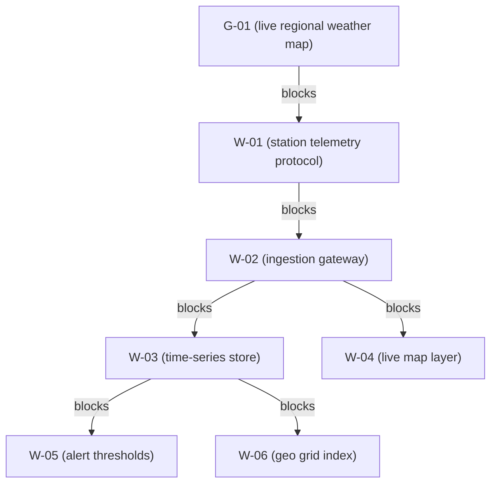
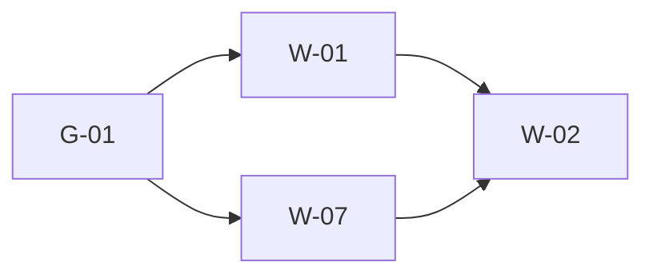
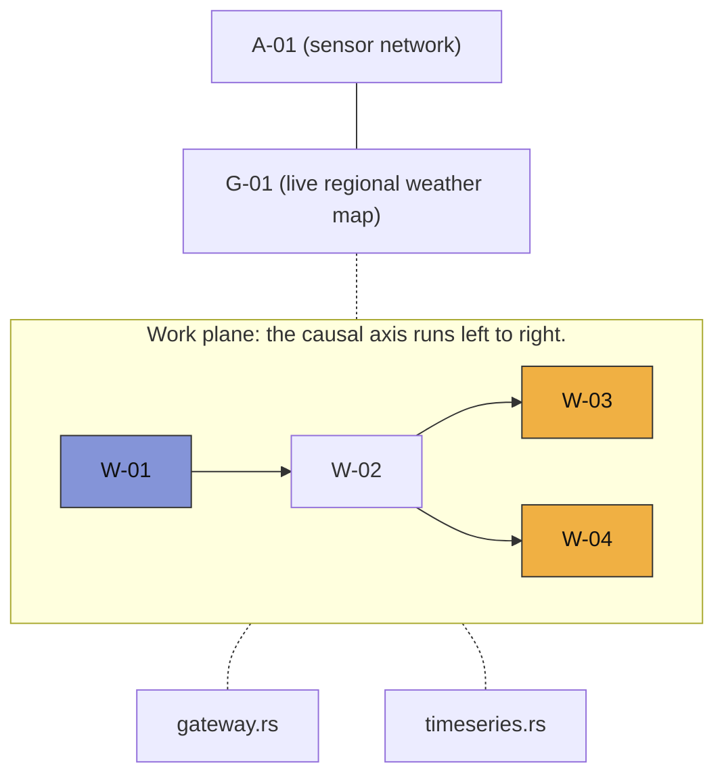

+++
title = "Your project has a light cone"
description = "Before anyone, human or agent, touches a line of code, you can compute exactly what must exist first and what will feel the change. The math is a century old."
date = 2026-09-04T18:00:00+03:00
tags = ["ai", "graphtheory", "programming", "themikadomethod"]
+++

In physics, every event wears two cones. The past one holds everything that could have influenced it; the future one holds everything it can influence. Nothing outside either cone can touch the event, at any speed. The boundary is strict enough that physicists have a technical word for the rest: *elsewhere*.

A task in a software project sits at exactly this junction. Some work must exist before the task can start. Other work will feel it when the task changes. Yet the honest answers to "what must come first?" and "what breaks if I touch this?" usually live nowhere: not in the ticket, not in anyone's head, not in the agent's context window. They live in the dependency structure, where nobody looks until something snaps.

I maintain [Grove](https://github.com/alxshelepenok/grove), an open-source protocol for keeping long-running, agent-driven projects coherent. Its core query is borrowed from the physics picture: before a line of code is written, the agent asks for the **causality cone** of the task it is about to start. This article explains what that cone is, which piece of 1927 graph theory hides inside it, and why the idea matters more with every month that coding agents take over larger stretches of our work.

## Two questions every change asks

Every non-trivial change quietly asks two questions:

1. <b>What must be true before I start?</b> The dependencies, in the order they can be satisfied.
2. <b>What will the change ripple into?</b> The blast radius.

Humans answer from memory and grep, and pay for the gaps in integration bugs. Agents have it worse: they answer *confidently*, from whatever slice of the repository happened to fit in the context window, with no internal signal separating recall from measurement. An agent that has "seen" the whole codebase still needs this project's dependency structure *now*, at this commit, for this task.

The cone replaces guesswork and memorization with computation.

## The cone is a query, not a document

In Grove a project is a typed graph. Work items (`W-01`, `W-02`, …) and goals (`G-01`, …) are nodes. An edge labeled `blocks` says that one thing must be finished before the other may start; goals join the same graph, so a goal can gate the work that serves it.

The example below is a plan: nothing has started yet, which is what lets the goals sit inside the causal spine. In a project mid-delivery the goals step out of `blocks`, and knowledge between goals travels a different road, through distilled discoveries. That road is a story for another time.

Given a seed task, the cone is two breadth-first walks over `blocks` edges:

- The **backward cone**: everything upstream, meaning what must finish first, transitively.
- The **forward cone**: everything downstream, meaning what the change will ripple into.

Nobody maintains this by hand, and nothing goes stale. The cone is not a document someone keeps current; it is computed from the graph on demand, which is the only way a view of a living project stays true.

Here is the worked example, sized to fit in your head but shaped like a real one. You run a network of field weather stations, and the goal is a live weather map of the region. Six tasks, one goal:



Grove gives work items IDs like `W-02` and goals IDs like `G-01`; the numbers carry no meaning beyond identity.

You are about to start `W-02` (ingestion gateway), the piece that receives telemetry from every station. One command, `grove packet W-02 --cone`, answers both questions before any code exists:

```text
## Contraction order

1. G-01  unverified  Live regional weather map
2. W-01  proposed    Station telemetry protocol

## Forward cone (impact)

- W-03  proposed  Time-series store
- W-04  proposed  Live map layer
- W-05  proposed  Alert thresholds
- W-06  proposed  Geo grid index

## Fragility

- G-01: 1 (brittle)
```

<i>Output from a real session; I trimmed the Definition-of-Ready section that normally sits above the cone.</i>

Three sections, three jobs.

## The order you collapse dependencies in

The contraction order is the backward cone sorted topologically: the sequence in which upstream work can actually be finished. If you know the [Mikado method](https://mikadomethod.info/), this looks familiar, because Mikado is exactly this done by hand: start from the change you want, trace back through the prerequisites, and implement in reverse dependency order until nothing is left to undo.

The cone is Mikado with the tracing automated. The agent is not guessing a safe way to approach `W-02` (ingestion gateway); it is handed one, with statuses attached, so it can see that `W-01` (station telemetry protocol) must land first and that `G-01` (live regional weather map) is itself still unverified.

## When one path is all you get

The last section, **Fragility**, is the part I want you to steal.

Between the goal and the seed task, Grove counts *vertex-disjoint paths*: chains of `blocks` edges from `G-01` to `W-02` that share no intermediate task. The implementation is a classic trick from network flow. Every task is split into an in-half and an out-half joined by an edge of capacity 1, and a max-flow run counts how many independent chains survive the splitting. Menger's theorem (1927) then guarantees the reading that matters: that count equals the size of the smallest set of tasks whose deletion severs the goal from this work item.

So the fragility number is redundancy made exact:

- **k = 0**: no `blocks`-path at all. The task is not structurally connected to the goal it claims to serve.
- **k = 1**: *brittle*. One dead task between the goal and this one, and the goal is cut off. A single point of failure, named by ID.
- **k ≥ 2**: independent chains. The connection survives the loss of any one task.

Our gateway is brittle: `G-01` reaches `W-02` only through `W-01`, because every station reports over a single transport. The fix is not a paragraph in a design doc. It is a graph operation: add a second transport and two edges.

```console
$ grove add w --title="LoRa mesh backhaul"
W-07
$ grove link W-07 blocks W-02
$ grove link G-01 blocks W-07
```

The same query now reports:

```text
## Contraction order

1. G-01  unverified  Live regional weather map
2. W-01  proposed    Station telemetry protocol
3. W-07  proposed    LoRa mesh backhaul

## Forward cone (impact)

- W-03  proposed  Time-series store
- W-04  proposed  Live map layer
- W-05  proposed  Alert thresholds
- W-06  proposed  Geo grid index

## Fragility

- G-01: 2 disjoint blocks-paths
```

That `2` is the picture below: two routes from `G-01` to `W-02` sharing no middle task.



Lose either middle task and the goal still reaches the gateway; lose both and it is severed.

The mesh backhaul was probably on someone's mental list anyway; a field network that reports over one radio is a field network with a countdown. What changed is that the redundancy is now a first-class, queryable fact of the project. Grove's `triage` command goes further: when it finds a task whose goal connection is brittle, the suggested action is literally `add a redundant path (blocks)`. The tool does not just measure fragility; it names the cure.

## A bounded view must declare its bounds

The cone is bounded on purpose: by default four hops and fifty nodes, tunable with `--cone-depth` and `--cone-max`. A context feed for an agent should be small by construction, not pruned by hope.

But boundedness has a moral clause. When the horizon cuts the cone, the output says so, on the last line. Here is the same packet with the horizon pulled back to one hop:

```text
## Contraction order

1. W-01  proposed  Station telemetry protocol
2. W-07  proposed  LoRa mesh backhaul

## Forward cone (impact)

- W-03  proposed  Time-series store
- W-04  proposed  Live map layer

## Fragility

- G-01: 2 disjoint blocks-paths

> cone truncated (depth=1, max=50)
```

Three things happened, and all three are honest. The goal fell out of the contraction order, because it now sits two hops away, beyond the horizon. The impact list shrank to the first hop. The fragility count still reads 2, because the horizon bounds what the packet lists, not what the protocol computes over the full graph. And the last line declares that the view is partial, and how partial. Contrast that with a context window, which also shows a truncated world, just silently. A protocol for autonomous agents cannot afford silent truncation anywhere: a partial truth that does not declare itself is a lie of omission, and agents act on it at full confidence.

## Seeing the cone

The cone renders in 3D in Grove's desktop app, and the axes carry meaning rather than decoration:

- One axis is **causal direction**: dependencies behind the seed, the seed itself, impact ahead of it. Past, present and future read as blue, pale and orange zones on the work plane.
- The vertical axis is **abstraction**. The work plane holds tasks. Below it hang the *files* those tasks touch, which maps the cone into code space. Above it sit themes, goals and areas: the *why* hovering over the *what*. Membership links stitch the strata together vertically, while `blocks` edges stay on the work plane as the causal spine.
- The project's **critical path** is computed independently, and the edges where it crosses the cone light up in an accent color, so you can see whether this task sits on the longest unfinished chain.

The same example, as the desktop view lays it out:



Solid edges are `blocks`, the causal spine. Dotted ones are membership: which goal a task serves, which files it touches. The seed sits at the origin; blue nodes are the past cone, orange the future.

## The cone is the right unit of context

Why does this matter more now than in 2010?

Because for an agent, the alternatives are all bad. The whole repository does not fit. A summary of the project is lossy in ways nobody can audit. The agent's own memory of how the codebase works is a claim, not a measurement, and recall is not evidence.

The causal neighborhood of the change is the slice that actually gates a safe start. It is exact, it is small by construction, and it points in both directions of time: what must exist before me, who is downstream of me, how brittle my connection to the goal is. An agent fed a cone starts work knowing what a careful senior engineer would try to know first, except the agent knows it by computation, at every single task, without getting tired at 4 PM.

The graph, not the conversation, is the durable artifact. Models will come and go, providers will die mid-goal, and the geometry will still hold: the task had one route to its goal, or two; the blast radius was four items, or forty. A causality cone is the light the graph throws. Compute it before the first edit, and never again mistake a confident summary for the shape of the thing.
